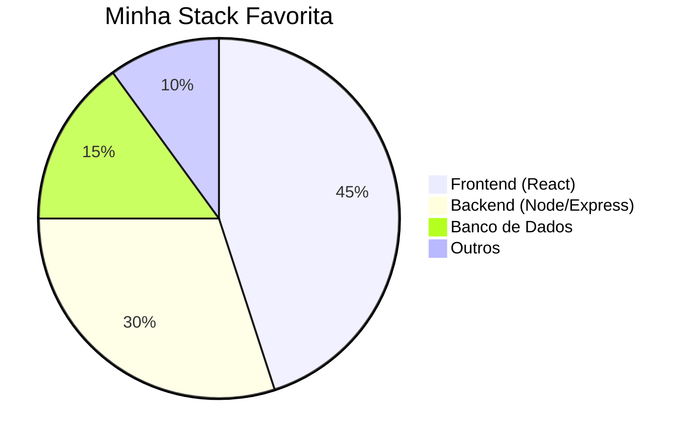

# 💼 Portfólio Profissional

✨ Criei um portfólio moderno com **painel administrativo completo**, onde posso gerenciar meus projetos, habilidades, visual do site e dados de contato, tudo em tempo real!

---

<div align="center">


<h3 style="color:#bbb;">Admin Dashboard + Landing Page com React e Node.js</h3>
</div>

---

## 🎯 Funcionalidades Principais

### 🌐 Frontend (Landing Page)

- 🌙 **Tema Escuro/Apagão** – Brincadeira visual com modo noturno
- 🧩 **Seção de Projetos Dinâmica** – Escolha entre grid ou carrossel (Swiper)
- 🧠 **Skills Controláveis** – Inclusão, remoção e ordenação direto do painel
- 📂 **Integração com GitHub** – Puxa repositórios automaticamente
- 📱 **Responsivo** – Totalmente adaptado a diferentes telas
- 🧠 **SEO configurado** – Open Graph, Sitemap, Robots.txt, etc.

### 🔐 Painel Administrativo

- 🔒 **Login com JWT**
- 📊 **Dashboard com Gráficos e Clima**
- ✏️ **CRUD Completo** para Projetos e Skills
- ⚙️ **Configurações de Layout**
- 💌 **Envio de Contato com Nodemailer**
- 📈 **Analytics de Visualizações**
- 🔒 **Segurança com Helmet e CORS**

---

## ⚙️ Tecnologias Utilizadas

| Frontend     | Backend | Banco de Dados | Outros                   |
| ------------ | ------- | -------------- | ------------------------ |
| React        | Node.js | PostgreSQL     | Prisma ORM               |
| Swiper.js    | Express |                | Nodemailer               |
| Axios        | JWT     |                | Chart.js                 |
| Helmet       | dotenv  |                | React Helmet Async (SEO) |
| React Router | CORS    |                | GitHub API               |

---



---

## 🚀 Como Rodar Localmente?

```bash
# Clone o repositório privado (não incluído aqui)
git clone ...

# Backend
cd backend
npm install
npx prisma migrate dev
npm start

# Frontend
cd ../frontend
npm install
npm start
```

---

## 🗂 Estrutura de Pastas

```
📁 backend/
├── src/
│   ├── controllers/
│   ├── routes/
│   ├── services/
│   ├── middlewares/
│   └── config/

📁 frontend/
├── public/
│   └── videos/
│       └── demo.gif
└── src/
    ├── components/
    ├── pages/
    └── styles/
```

---

## ✅ Recursos Implementados

- [x] Painel Admin com autenticação
- [x] CRUD de Projetos e Skills
- [x] Tema escuro com "Lanterna"
- [x] Integração com GitHub API
- [x] Envio de mensagens via Nodemailer
- [x] Configuração de layout de exibição
- [x] Analytics e visualizações
- [x] SEO: Open Graph, Sitemap, Robots.txt

---

## 👨‍💻 Autor

**Henrique Crosio**  
📬 [henrique.crosio.dev@gmail.com](mailto:henrique.crosio.dev@gmail.com)

---

## 📄 Licença

Distribuído sob a licença MIT.
