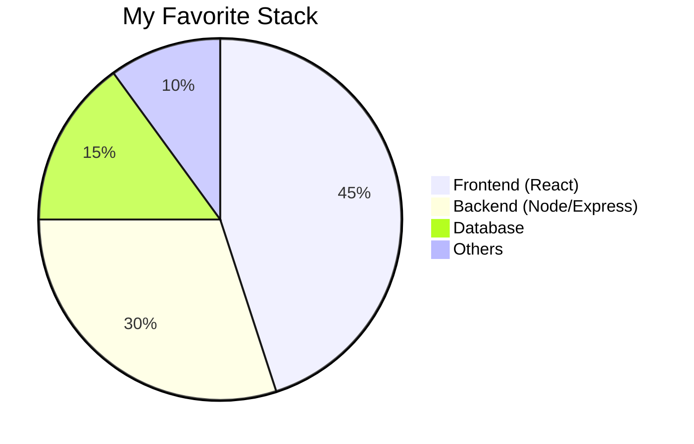

# 💼 Professional Portfolio

✨ **I created a modern portfolio with a full admin panel** to manage my projects, skills, and layout in real-time.

---

<div align="center">

<!-- Portfolio GIF -->


<h3 style="color:#bbb;">Full Admin Panel | React & Node.js</h3>
</div>

---

### **Frontend (Landing Page)**

✅ **Dark Mode (Blackout) / Light Mode** – A fun feature for dark mode lovers

✅ **Dynamic Projects Section** – Grid or Swiper layout

✅ **Manageable Skills** – Add, remove, and sort skills

✅ **GitHub Integrated** – Automatically lists public repositories

### **Admin Panel**

🔒 **Secure Login** (JWT)  
📊 **Interactive Dashboard** – Charts, weather, and metrics  
🛠️ **Full CRUD** – Projects and skills management  
📱 **Responsive Design** – Optimized for mobile screens

---

## ⚙️ **Technologies Used**

| Frontend  | Backend | Database   |
| --------- | ------- | ---------- |
| React     | Node.js | PostgreSQL |
| Swiper.js | Express | Prisma ORM |
| Axios     | JWT     |            |

---



---

## 🛠️ **How to Run Locally**

```bash
# Backend
cd backend && npm install
npx prisma migrate dev
npm start

# Frontend
cd ../frontend && npm install
npm start
```

---

### Project Structure

---

- 📁 backend
- └── src/
- ├── controllers/
- ├── routes/
- ├── services/
- └── middlewares/

- 📁 frontend
- ├── public/
- │ └── videos/demo.gif
- └── src/
- ├── components/
- └── pages/

---

## ✅ Implemented Features

**Admin Panel with authentication**

- Projects and Skills CRUD

- Dark theme with "Flashlight" toggle

- GitHub API integration

- Message sending via Nodemailer

- Display layout configuration

- Analytics and view tracking

- SEO: Open Graph, Sitemap, Robots.txt

---

## 👨‍💻 Autor

**Henrique Crosio**
📬 [henrique.crosio.dev@gmail.com](mailto:henrique.crosio.dev@gmail.com)

---

## 📄 Licença

Distributed under the MIT License.
